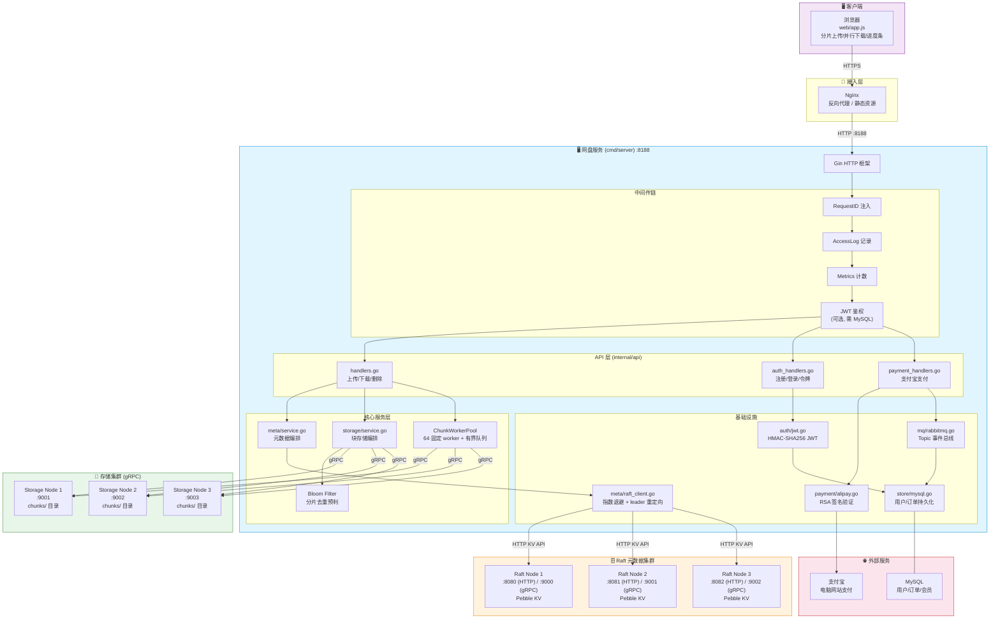
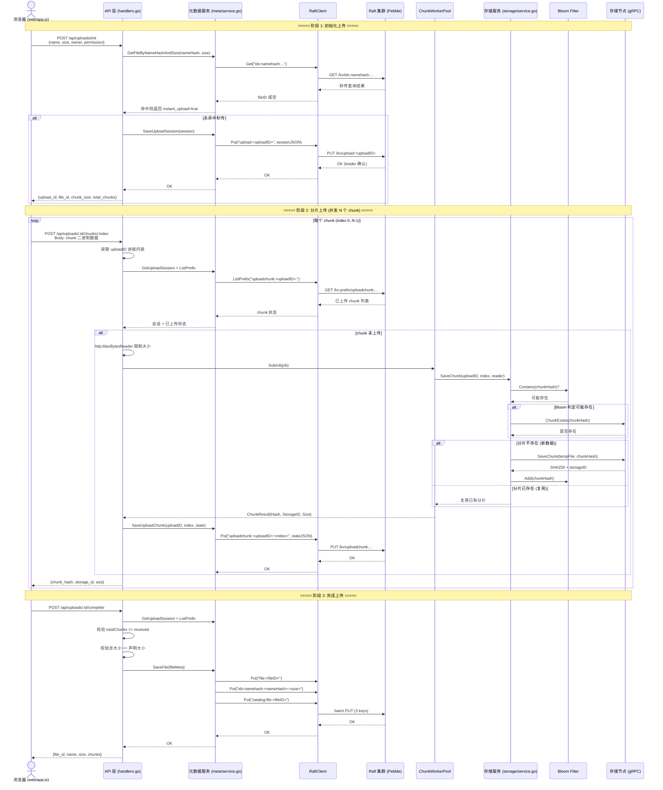
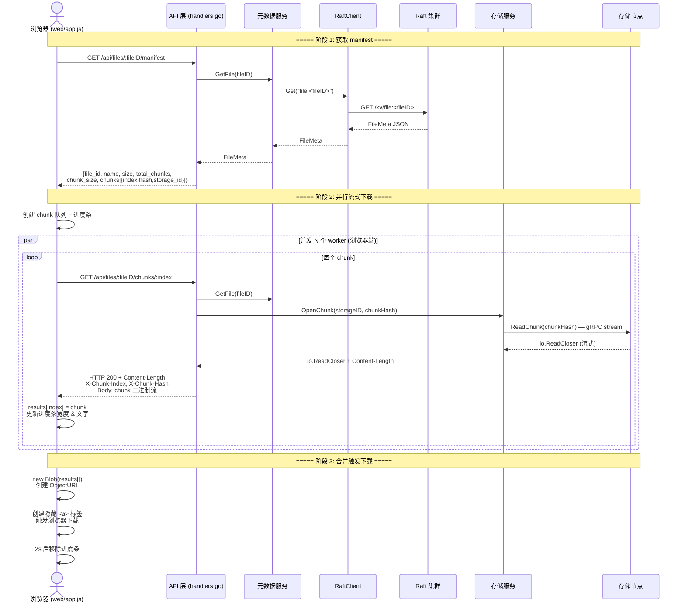
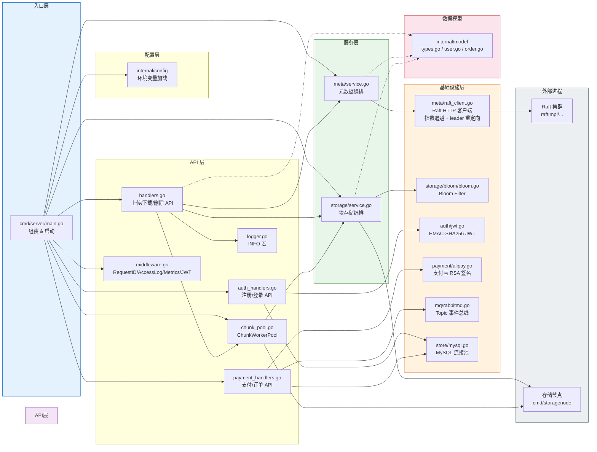
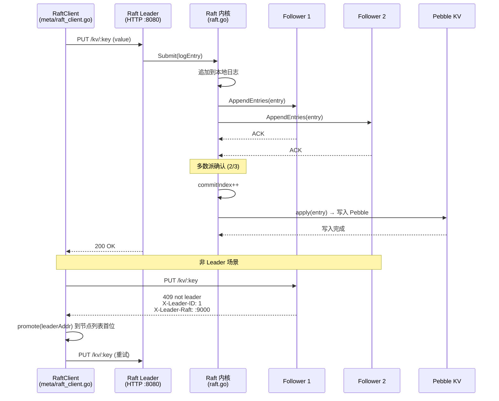
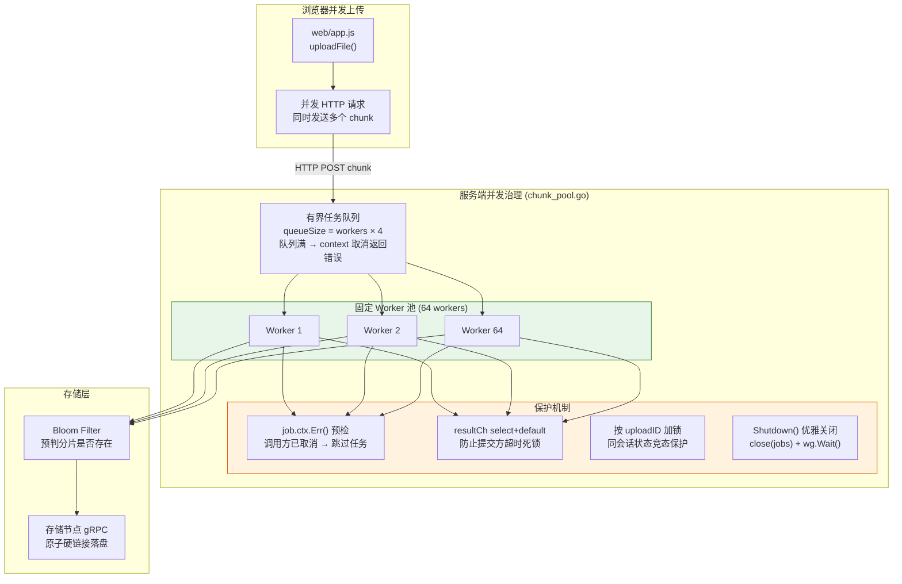

# webdownld_go.dir - 完整执行流程报告

本文按”文件名 + 函数名 + 思路 + 执行步骤”描述 `webdownld_go.dir` 的完整执行流程。当前工程集成自研 Raft、JWT 用户系统、支付宝支付、Topic 事件总线。

## 0. 系统目标与总体架构

目标能力：

1. 元数据一致性：文件名、大小、时间、权限、chunk 映射、上传会话进入 Raft。
2. 秒传：文件名哈希 + 文件大小命中完整文件后直接返回。
3. 断点续传：上传会话与 chunk 完成状态持久化，失败后只补传缺失分片。
4. 并发分片上传：服务端 worker pool + 有界队列治理写入并发；支持优雅关闭。
5. 并发分片下载：浏览器按 manifest 并行拉取 chunk 后合并；服务端流式传输避免 OOM。
6. 文件删除：API 删除元数据、秒传索引、目录项，异步清理存储分片。
7. 可观测性：INFO 统一日志宏、slog JSON 日志 + requestID 链路追踪、Prometheus Metrics、pprof、健康检查。
8. JWT 用户系统：注册、登录、双令牌签发（Access Token + Refresh Token），MySQL 持久化。支持管理员账号（通过 `ADMIN_USERNAME`/`ADMIN_PASSWORD` 环境变量配置，服务启动时自动播种，无需注册即可直接登录）。
9. 会员充值：支付宝电脑网站支付对接，订单生命周期管理，支付回调验签。
10. Topic 事件总线：内存版 RabbitMQ Topic Exchange，`order.#` / `member.#` 路由匹配。
11. Redis 分布式锁：自研 RESP2 极简 Redis 客户端，SET NX PX 原子获取 + Lua 脚本安全释放 + 看门狗自动续期，替代进程内 sync.Map，支持多实例部署。

架构分层：

- 网盘入口：`cmd/server/main.go`
- API 层：`internal/api/handlers.go`、`auth_handlers.go`、`payment_handlers.go`
- 中间件层：`internal/api/middleware.go`（requestID、access log、metrics、JWT auth）
- 认证层：`internal/auth/jwt.go`（HMAC-SHA256 JWT 签发与校验）
- 支付层：`internal/payment/alipay.go`（支付宝 RSA 签名与验签）
- 消息队列：`internal/mq/rabbitmq.go`（Topic 事件总线）
- 持久层：`internal/store/mysql.go`（MySQL 连接池 + 自动建表）
- 分布式锁：`internal/lock/lock.go`（Redis 分布式锁 + 看门狗）
- 元数据层：`internal/meta/service.go`
- Raft 访问层：`internal/meta/raft_client.go`
- 块存储层：`internal/storage/service.go`
- Bloom Filter：`internal/storage/bloom/bloom.go`
- 数据模型：`internal/model/types.go`、`user.go`、`order.go`
- 配置层：`internal/config/config.go`
- Raft 集群：`raftImpl/cmd/raftnode/main.go`
- Raft 内核：`raftImpl/internal/raft/raft.go`

### 0.1 流程执行架构图

#### 0.1.1 系统部署架构图



#### 0.1.2 上传流程时序图



#### 0.1.3 下载流程时序图



#### 0.1.4 内部模块依赖图



#### 0.1.5 Raft 写入一致性流程



#### 0.1.6 并发分片上传治理模型



---

## 1. 启动流程

### 1.1 启动 Raft 集群

文件：`/root/projects/webdownld_go.dir/raftImpl/cmd/raftnode/main.go`

命令：

```bash
cd /root/projects/webdownld_go.dir/raftImpl
go build -o bin/raftnode ./cmd/raftnode

./bin/raftnode -id=1 -raft=127.0.0.1:9000 -http=127.0.0.1:8080 -bootstrap -persist=./data/n1/state.json -db=./data/n1/pebble
./bin/raftnode -id=2 -raft=127.0.0.1:9001 -http=127.0.0.1:8081 -join=127.0.0.1:8080 -persist=./data/n2/state.json -db=./data/n2/pebble
./bin/raftnode -id=3 -raft=127.0.0.1:9002 -http=127.0.0.1:8082 -join=127.0.0.1:8080 -persist=./data/n3/state.json -db=./data/n3/pebble
```

执行过程：

1. 打开 Pebble 数据库。
2. 创建 `applyCh` 接收 Raft 已提交日志。
3. `raft.NewRaft(...)` 启动选举、心跳、日志复制和 apply loop。
4. HTTP 层暴露 `/status`、`/kv/:key`、`/kv-prefix/*prefix`、`/cluster/join`。
5. 非 bootstrap 节点通过 `/cluster/join` 加入集群。

关键修复：

- `GET/PUT/DELETE /kv` 仅 leader 处理；follower 返回 `409 not leader`、leader id 和 leader 的 Raft RPC 地址。
- `PUT/DELETE` 提交 Raft 日志后，要等 Pebble 状态机 apply 完成才返回。
- 新增 `GET /kv-prefix/*prefix` 支持前缀扫描，供目录索引和分片状态读取使用。

### 1.2 启动网盘服务

文件：`/root/projects/webdownld_go.dir/cmd/server/main.go`

函数：`main()`

执行过程：

1. 初始化 `slog` JSON handler 为全局日志器。
2. `config.Load()` 读取 `APP_ADDR`、`DATA_ROOT`、`STORAGE_NODE_IDS`、`RAFT_HTTP_NODES`。
3. 创建数据目录。
4. 构建 `meta.NewRaftClient(cfg.RaftHTTPNodes)`。
5. 构建 `meta.NewService(...)`。
6. 构建 `storage.NewService(...)`（启动时后台预热 Bloom Filter）。
7. 初始化 Gin 引擎并挂载中间件：`RequestIDMiddleware` → `AccessLogMiddleware` → `MetricsMiddleware`。
8. 注册静态资源、首页、健康检查和 API 路由。
9. 启动 HTTP Server。
10. 监听 SIGINT/SIGTERM 信号 → 优雅关闭 HTTP Server（10s 超时）→ `h.Shutdown()` 关闭 Worker Pool。

管理员账号：MySQL 可用时，`NewMySQLStore` 在自动建表后调用 `seedAdmin()`，若管理员不存在则通过 bcrypt 哈希后 INSERT 创建（`is_admin=1`）。

---

## 2. Raft 元数据访问机制

文件：`/root/projects/webdownld_go.dir/internal/meta/raft_client.go`

结构体：`RaftClient`

核心函数：

- `Put(ctx, key, value)` → 通过 `doWithRetry` 实现带退避重试。
- `Get(ctx, key)` → 通过 `getWithBackoff` 实现带退避重试。
- `Delete(ctx, key)` → 通过 `doWithRetry` 实现带退避重试。
- `ListPrefix(ctx, prefix)` → 带退避重试的前缀扫描。

执行过程：

1. 客户端按配置节点顺序请求 Raft HTTP。
2. 如果节点返回 `409 not leader`，解析 leader 地址并 `promote()` 到节点列表首位。
3. 如果请求失败且错误可重试（网络错误 / 409 / 5xx），等待指数退避时间后重试。
4. 退避策略：`50ms * 2^attempt` + 随机抖动 ±25%，最大 2s，最多 10 次重试。
5. 如果错误不可重试（如 404 key not found），立即返回不重试。
6. 成功后返回结果。

设计思路：

- 写入与读取都尽量落到 leader，减少 follower stale read。
- 目录列表不再依赖全量字符串读改写，而是通过 Raft KV 前缀扫描获得索引项。

---

## 3. 元数据模型与键空间

文件：`/root/projects/webdownld_go.dir/internal/model/types.go`

结构体：

- `ChunkMeta`：文件完成后的 chunk 元数据。
- `FileMeta`：文件元数据。
- `UploadSession`：上传会话基础信息。
- `UploadChunkState`：单个 chunk 的完成状态。

键空间：

- `upload:<uploadID>` -> 上传会话基础 JSON。
- `uploadchunk:<uploadID>:<index>` -> 单个 chunk 完成状态 JSON。
- `file:<fileID>` -> 文件元数据 JSON。
- `idx:namehash:<nameHash>:<size>` -> fileID。
- `catalog:file:<fileID>` -> fileID。

关键变化：

- 秒传索引带上 size，避免同名不同大小文件覆盖索引。
- 每个 chunk 状态单独写 key，避免并发上传时覆盖整份 `UploadSession`。
- 目录索引用 `catalog:file:` 前缀扫描，避免 `catalog:files` 读改写丢更新。

---

## 4. 上传流程

### 4.1 初始化上传

文件：`/root/projects/webdownld_go.dir/internal/api/handlers.go`

函数：`initUpload(c *gin.Context)`

执行过程：

1. 接收 `name/size/owner/permission`。
2. 计算 `nameHash := meta.NameHash(req.Name)`。
3. 调 `GetFileByNameHashAndSize(nameHash, size)` 做秒传判断。
4. 命中完整文件则返回 `instant_upload=true`。
5. 未命中则创建 `UploadSession`。
6. `SaveUploadSession(...)` 写入 `upload:<uploadID>`。
7. 返回 `upload_id/file_id/chunk_size/total_chunks`。

### 4.2 查询续传状态

文件：`/root/projects/webdownld_go.dir/internal/meta/service.go`

函数：`GetUploadSession(ctx, uploadID)`

执行过程：

1. 读取 `upload:<uploadID>` 获取基础会话。
2. 调用 `ListPrefix("uploadchunk:<uploadID>:")` 扫描已完成 chunk。
3. 将扫描结果合并进 `Received` 和 `ChunkMap`。
4. API 返回 `received[]` 给浏览器。

### 4.3 上传单个 chunk

文件：`/root/projects/webdownld_go.dir/internal/api/handlers.go`

函数：`uploadChunk(c *gin.Context)`

执行过程：

1. 按 `uploadID` 获取进程内会话锁。
2. 读取上传会话并校验 chunk index。
3. 如果该 chunk 已存在，直接幂等返回。
4. `http.MaxBytesReader` 限制请求体最大为 `chunkSize + 1`。
5. 校验实际 chunk 大小是否符合上传计划。
6. 提交到 `ChunkWorkerPool`。
7. worker 调用 `storage.SaveChunk(...)` 落盘并计算 SHA256。
8. `SaveUploadChunk(...)` 写入 `uploadchunk:<uploadID>:<index>`。
9. 返回 chunk hash、storage id、size 和是否复用。

### 4.4 完成上传

文件：`/root/projects/webdownld_go.dir/internal/api/handlers.go`

函数：`completeUpload(c *gin.Context)`

执行过程：

1. 获取会话锁。
2. 读取会话，并通过前缀扫描合并所有 chunk 状态。
3. 校验已上传数量等于 `TotalChunks`。
4. 逐块校验 chunk 元数据和大小。
5. 校验 chunk 总大小等于文件声明大小。
6. 构造 `FileMeta`。
7. `SaveFile(...)` 写入：
   - `file:<fileID>`
   - `idx:namehash:<nameHash>:<size>`
   - `catalog:file:<fileID>`
8. 返回最终文件元数据。

---

## 5. 块存储流程

文件：`/root/projects/webdownld_go.dir/internal/storage/service.go`

### 5.1 启动预热

函数：`warmupBloom()`

执行过程：

1. `NewService` 后台 goroutine 扫描所有存储节点目录。
2. 将已有 `.chunk` 文件的哈希（不含后缀）加入 Bloom Filter。
3. 后续 `findChunk` 可优先通过 Bloom Filter 预判分片是否存在。

### 5.2 保存 chunk

函数：`SaveChunk(uploadID, index, reader)`

执行过程：

1. 在 `uploads/<uploadID>/` 下创建唯一临时文件。
2. `io.Copy(io.MultiWriter(file, hash), reader)` 边写边计算 SHA256。
3. 关闭临时文件。
4. **Bloom Filter 预判**：`s.bf.Contains(chunkHash)` 为 false 则直接跳过磁盘扫描；为 true 时才遍历节点目录做 `os.Stat`，降低磁盘 IO。
5. 跨存储节点查找同 hash chunk，命中则删除临时文件并复用。
6. 未命中则通过轮询选择存储节点。
7. 使用 `os.Link(tmpPath, finalPath)` 原子落正式 chunk 文件。
8. 如果并发写入导致目标已存在，则删除临时文件并按复用处理。
9. 新 chunk 落盘后调用 `s.bf.Add([]byte(chunkHash))` 更新 Bloom Filter。

### 5.3 流式读取 chunk

函数：`OpenChunk(storageID, chunkHash)`

执行过程：

1. 拼接 `chunks/<storageID>/<chunkHash>.chunk`。
2. `os.Stat` 获取文件大小。
3. `os.Open` 返回 `io.ReadCloser`。
4. API 层通过 `c.DataFromReader` + `Content-Length` 流式传输，避免全量读入内存。

### 5.4 删除 chunk

函数：`DeleteChunk(storageID, chunkHash)`

执行过程：

1. 拼接路径后 `os.Remove` 删除 chunk 文件。

---

## 6. 下载流程

### 6.1 获取 manifest

文件：`/root/projects/webdownld_go.dir/internal/api/handlers.go`

函数：`fileManifest(c *gin.Context)`

执行过程：

1. 根据 `fileID` 读取 `FileMeta`。
2. 返回 `file_id/name/size/total_chunks/chunk_size/chunks[]`。

### 6.2 流式下载 chunk

文件：`/root/projects/webdownld_go.dir/internal/api/handlers.go`

函数：`downloadChunk(c *gin.Context)`

执行过程：

1. 根据 `fileID + index` 找到 `ChunkMeta`。
2. 调用 `storage.OpenChunk(storageID, chunkHash)` 获取 `io.ReadCloser` 和文件大小。
3. 设置 `Content-Length` 响应头。
4. 使用 `c.DataFromReader` 流式传输，gin 自动分块读取并写入响应，避免大 chunk 全量加载到内存。
5. 附加 `X-Chunk-Index`、`X-Chunk-Hash`、`X-Source-Storage` 响应头。

### 6.3 浏览器并行下载（含进度）

文件：`/root/projects/webdownld_go.dir/web/app.js`

函数：`downloadFile(fileID, name, card)`

执行过程：

1. 请求 `/api/files/:fileID/manifest`。
2. 根据 manifest 建立 chunk 队列。
3. 在文件卡片内创建内联进度条（`.download-progress`）。
4. 启动并发 worker 拉取 chunk。
5. 每完成一个 chunk，更新进度条宽度和文字。
6. 按 index 放回 `results[index]`。
7. 全部完成后 `new Blob(results)` 合并并触发浏览器下载。
8. 2 秒后自动移除进度条；下载失败时显示错误信息。

---

## 7. 分布式锁机制

文件：`/root/projects/webdownld_go.dir/internal/lock/lock.go`

### 7.1 锁获取（Lock）

- 通过自研极简 RESP2 协议 Redis 客户端发送 `SET key token NX PX ttlMs`。
- token 为 `crypto/rand` 生成的 16 字节十六进制字符串，保证持有者唯一标识。
- SET 返回 nil 表示锁已被其他实例持有，返回 error。
- 获取成功后启动看门狗 goroutine。

### 7.2 看门狗续期（Watchdog）

- goroutine 每隔 `ttl / 3` 秒向 Redis 发送 `EXPIRE key ttlSeconds`。
- 续期失败（Redis 断连）时 goroutine 静默退出，业务完成后 Unlock 会尝试主动释放。
- 锁的 TTL 默认 30 秒，续期间隔 10 秒，既保证安全又不频繁。

### 7.3 锁释放（Unlock）

- 通过 Lua 脚本原子执行：`if redis.call('GET', key) == token then return redis.call('DEL', key) else return 0 end`。
- GET + DEL 必须原子，否则可能误删其他实例刚获取的锁。
- 先停止看门狗 goroutine，再释放锁，避免释放后仍有续期命令发送。

### 7.4 锁工厂（LockFactory）

- `NewLockFactory(addr, password, db, ttl)` 创建 Redis 连接并 PING 验证。
- `NewLock(key)` 基于同一连接创建锁实例，复用连接池。
- `Close()` 关闭连接，在 `Handler.Shutdown()` 时调用。

### 7.5 在 uploadChunk / completeUpload 中的使用

```go
dl := h.lockFactory.NewLock("upload:lock:" + uploadID)
if err := dl.Lock(ctx); err != nil { ... }
defer dl.Unlock(ctx)
```

替代原有的进程内 `sync.Map` + `sync.Mutex`，多实例部署时保证同一上传会话的 chunk 串行处理。

---

## 8. 并发治理

文件：`/root/projects/webdownld_go.dir/internal/api/chunk_pool.go`

结构体：`ChunkWorkerPool`

执行过程：

1. 服务启动时创建固定数量 worker，通过 `sync.WaitGroup` 追踪。
2. chunk 上传请求进入有界队列（`queueSize = workers * 4`）。
3. 队列满或请求取消时通过 context 返回错误。
4. worker 执行前检查 `job.ctx.Err()`，若调用方已取消则跳过任务（避免 resultCh 无人接收导致 goroutine 永久阻塞）。
5. worker 发送结果到 resultCh 时使用 `select + default`，防止提交方超时已退出导致死锁。
6. `Shutdown()` 方法关闭 jobs channel 并 `wg.Wait()` 等待所有 worker 退出。

并发保护：

- 使用 Redis 分布式锁按 `uploadID` 加锁（`upload:lock:<uploadID>`），通过 SET NX PX 原子获取，Lua 脚本安全释放，跨实例互斥。
- 看门狗机制：持有锁期间每 `ttl/3` 间隔自动 EXPIRE 续期，防止大文件分片上传时锁过期被抢占。
- 跨进程依赖 `uploadchunk:<uploadID>:<index>` 单 key 写入降低覆盖风险。
- 目录索引使用前缀扫描，不再进行共享字符串读改写。
- Raft 客户端使用指数退避 + jitter，减少集群动荡时的惊群效应。
- Bloom Filter 使用读写锁保护，支持安全并发读写。

---

## 9. 文件删除流程

文件：`/root/projects/webdownld_go.dir/internal/api/handlers.go`

函数：`deleteFile(c *gin.Context)`

执行过程：

1. 根据 `fileID` 读取 `FileMeta`（不存在返回 404）。
2. 调用 `meta.DeleteFile(ctx, fm)`：
   - 删除 `file:<fileID>`
   - 删除 `idx:namehash:<nameHash>:<size>`
   - 删除 `catalog:file:<fileID>`
3. 异步 goroutine 遍历所有 chunk，逐个 `storage.DeleteChunk()` 清理存储分片。
4. 不等待存储清理完成，立即返回响应。

---

## 10. 可观测性体系

文件：`/root/projects/webdownld_go.dir/internal/api/middleware.go`

### 9.1 结构化日志

- 使用 Go 标准库 `log/slog` 输出 JSON 格式日志。
- `AccessLogMiddleware` 记录每个请求的：`req_id`、`method`、`path`、`status`、`latency_ms`、`client_ip`。

### 9.2 Request ID 追踪

- `RequestIDMiddleware` 为每个请求注入唯一 ID（从 `X-Request-ID` 头读取或生成 8 字节随机 hex）。
- requestID 同时写入响应头 `X-Request-ID` 和 gin context，贯穿整个请求生命周期。

### 9.3 Metrics 端点

- `GET /metrics` 返回累积计数器：`upload_requests`、`download_requests`、`delete_requests`、`chunk_uploads`、`chunk_downloads`。
- `MetricsMiddleware` 在每次请求时原子递增对应计数器。

### 9.4 健康检查

- `GET /healthz`：探活端点，始终返回 `{"status":"ok"}`。
- `GET /readyz`：就绪检查，调用 `meta.ListFiles` 验证 Raft 元数据服务连通性。

### 9.5 性能分析

- 通过 `import _ "net/http/pprof"` 暴露 `/debug/pprof/` 端点，支持 CPU profile、heap profile、goroutine dump 等。

### 9.6 API 鉴权

- `JWTAuthMiddleware`：验证 Authorization header 中的 Bearer JWT 令牌，提取 `user_id`、`username`、`is_admin`、`is_member` 到 Gin Context。
- `AuthMiddleware`：旧版简易鉴权（已废弃，保留空实现兼容旧调用）。
- JWT Claims 包含 `is_admin` 字段，管理员通过环境变量 `ADMIN_USERNAME` / `ADMIN_PASSWORD` 配置，服务启动时自动创建。

---

## 11. 关键调用链

上传链：

```text
web/app.js:uploadFile()
  -> POST /api/uploads/init
     -> handlers.go:initUpload()
        -> meta/service.go:GetFileByNameHashAndSize()
        -> meta/service.go:SaveUploadSession()
  -> GET /api/uploads/:id/status
     -> handlers.go:uploadStatus()
        -> meta/service.go:GetUploadSession()
        -> raft_client.go:ListPrefix(uploadchunk:<uploadID>:)
  -> POST /api/uploads/:id/chunks/:index
     -> handlers.go:uploadChunk()
        -> chunk_pool.go:Submit()
        -> storage/service.go:SaveChunk()
        -> meta/service.go:SaveUploadChunk()
  -> POST /api/uploads/:id/complete
     -> handlers.go:completeUpload()
        -> meta/service.go:SaveFile()
```

下载链：

```text
web/app.js:downloadFile()
  -> GET /api/files/:fileID/manifest
     -> handlers.go:fileManifest()
  -> GET /api/files/:fileID/chunks/:index
     -> handlers.go:downloadChunk()
        -> storage/service.go:OpenChunk()  // 流式读取
```

删除链：

```text
web/app.js:deleteFile()
  -> DELETE /api/files/:fileID
     -> handlers.go:deleteFile()
        -> meta/service.go:DeleteFile()
           -> raft_client.go:Delete("file:<fileID>")
           -> raft_client.go:Delete("idx:namehash:...")
           -> raft_client.go:Delete("catalog:file:<fileID>")
        -> (async) storage/service.go:DeleteChunk()
```

Raft 写入链：

```text
handlers.go
  -> meta/service.go
  -> meta/raft_client.go:Put()
  -> raftImpl/cmd/raftnode/main.go:PUT /kv/:key
  -> raftImpl/internal/raft/raft.go:Submit()
  -> 多数派复制并提交
  -> apply 到 Pebble
  -> 唤醒 HTTP 请求返回
```

Raft 读取链：

```text
meta/raft_client.go:Get() / ListPrefix()
  -> raftImpl/cmd/raftnode/main.go
  -> follower 返回 not leader
  -> client 在配置节点中找到 leader
  -> leader 读取 Pebble 返回
```

---

## 12. 测试验证

已执行：

```bash
cd /root/projects/webdownld_go.dir
go test ./...

cd /root/projects/webdownld_go.dir/raftImpl
go test ./...
```

结果：

- 网盘服务所有包编译通过。
- Raft 子项目所有包编译通过，`internal/raft` 测试通过。
